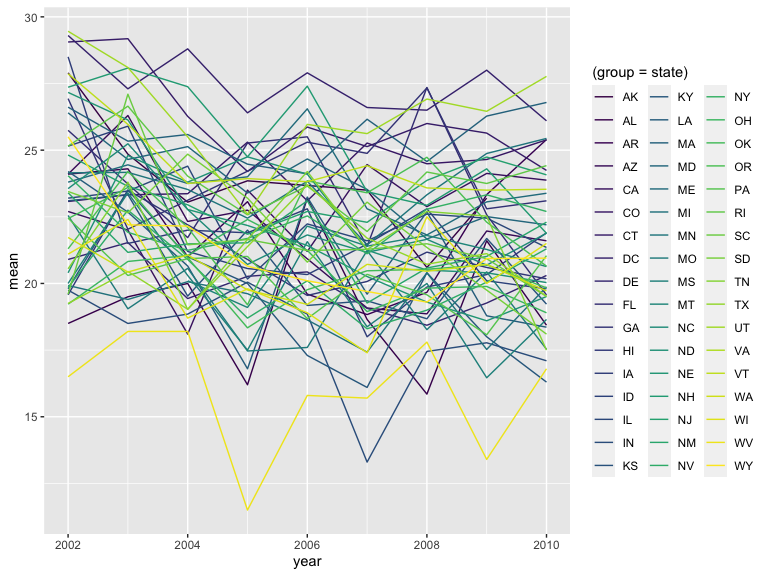
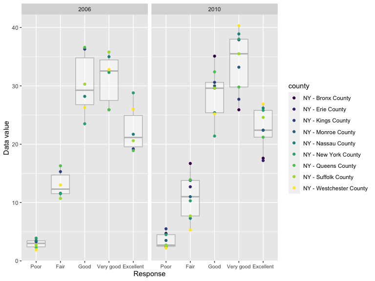

p8105_hw3_rl3411
================
rl3411
2023-10-13

``` r
library(tidyverse)
library(ggridges)
library(patchwork)
library(p8105.datasets)

knitr::opts_chunk$set(
    echo = TRUE,
    warning = FALSE,
    fig.width = 8, 
  fig.height = 6,
  out.width = "100%"
)

options(
  ggplot2.continuous.colour = "viridis",
  ggplot2.continuous.fill = "viridis"
)

scale_colour_discrete = scale_colour_viridis_d
scale_fill_discrete = scale_fill_viridis_d
```

# Problem 1

### Load Instacart data

``` r
data("instacart")

instacart = 
  instacart |> 
  as_tibble()
```

In the instacart dataset, there are 1384617 rows and 15 columns.

# Problem 2

### Load BRFSS data

``` r
library(p8105.datasets)
data("brfss_smart2010")

brfss_df =
  brfss_smart2010 |> 
  as_tibble() |> 
  janitor::clean_names() |> 
  rename(state = locationabbr,
         county = locationdesc) 
```

### Looking into the “Overall Health” topic

``` r
overall_health_df =
  filter(brfss_df, topic == "Overall Health") |> 
  arrange(factor(response, levels = c("Poor", "Fair", "Good", "Very good", "Excellent")))
```

### 2002 vs. 2010: States observing at 7 or more locations

``` r
locate7_2002 = overall_health_df |> 
  filter(year == "2002") |> 
  count(state) |> 
  arrange(n) |> 
  filter(n >= 7)

locate7_2010 = overall_health_df |> 
  filter(year == "2010") |> 
  count(state) |> 
  arrange(n) |> 
  filter(n >= 7)

compare1 = anti_join(locate7_2002, locate7_2010, by = "state") # all states in 2002 are in 2010
compare2 = anti_join(locate7_2010, locate7_2002, by = "state") # states in 2010 but not in 2002
```

In 2002, 13 states observed at 7 or more locations, which were AZ, ID,
IN, ME, MO, NV, SD, TN, TX, DE, GA, IL, KS, LA, NE, OK, OR, SC, VT, CO,
HI, MI, MN, OH, RI, WA, NH, NY, UT, MD, CT, FL, NC, MA, NJ, PA. These
states continued observing at 7 or more locations in 2010, and 9 states
also started observing at 7 or more locations that year, which are IA,
MS, WY, AL, AR, MT, ND, NM, CA.

### Spaghetti plot

``` r
exc_resp = overall_health_df |> 
  filter(response == "Excellent") |>  
  select(state, year, data_value) |> 
  group_by(state, year) |> 
  summarize(mean = mean(data_value, na.rm=T)) 

exc_resp |> 
  ggplot(aes(x = year, y = mean, color = (group = state))) + 
  geom_line()
```



### 2006 vs. 2010: Distribution of data for responses in NY

``` r
p2c_dataset = overall_health_df |>
  filter(state == "NY",
         year == "2006" | year == "2010") |> 
  select(year, county, response, data_value) 

p2c_dataset |> 
  ggplot(aes(x = factor(response, levels = c("Poor", "Fair", "Good", "Very good", "Excellent")), 
             y = data_value)) +
  xlab("Response") + ylab("Data value") +
  theme(axis.text.x = element_text(size = 8)) +
  geom_boxplot(color = "grey", alpha = 0.5) +
  geom_point(aes(color = county)) + 
  facet_grid(. ~ year)
```


