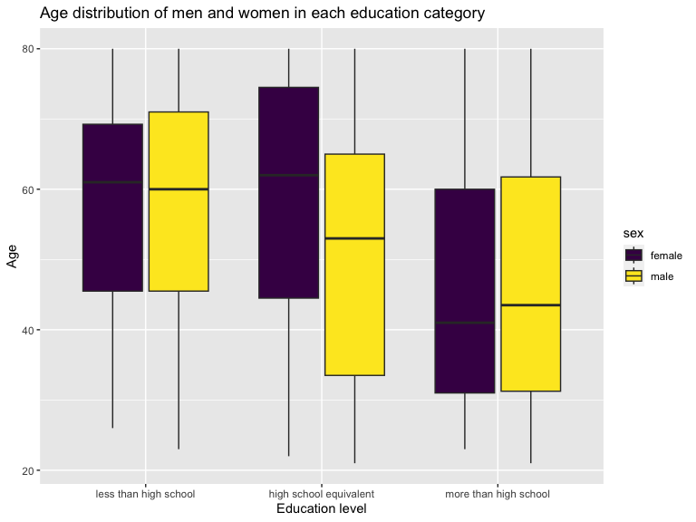

p8105_hw3_rl3411
================
rl3411
2023-10-14

``` r
library(tidyverse)
library(ggridges)
library(patchwork)
library(p8105.datasets)

knitr::opts_chunk$set(
    echo = TRUE,
    warning = FALSE,
    fig.width = 8, 
  fig.height = 6,
  out.width = "100%"
)

options(
  ggplot2.continuous.colour = "viridis",
  ggplot2.continuous.fill = "viridis"
)

scale_colour_discrete = scale_colour_viridis_d
scale_fill_discrete = scale_fill_viridis_d
```

# Problem 1

### Load Instacart data

``` r
data("instacart")

instacart = 
  instacart |> 
  as_tibble()
```

### Understanding the structure of `instacart`

In the `instacart` dataset, there are 1384617 rows and 15 columns. Each
row corresponds to each item purchased within each order. The variables
found in the dataset are:

ID group variables:

1.  `order_id`: order identification number
2.  `product_id`: product identification number
3.  `user_id`: customer identification number
4.  `aisle_id`: aisle identification number
5.  `department_id`: department identification number

Product group variables:

6.  `product_name`: name of the product
7.  `aisle`: the aisle name of where the product is
8.  `department`: which department the product belongs to

Order group variables:

9.  `add_to_cart_order`: order in which each product was added to cart
10. `reordered`: 1 if this product has been ordered by this user in the
    past, 0 otherwise
11. `order_number`: the order sequence number for this user (1=first,
    n=nth)
12. `order_dow`: the day of the week on which the order was placed
13. `order_hour_of_day`: the hour of the day on which the order was
    placed
14. `days_since_prior_order`: days since the last order, capped at 30,
    NA if `order_number=1`
15. `eval_set`: which evaluation set this order belongs in (train in
    this case)

Overall, there are 39123 products from the 131209 orders, purchased by
`length(table(pull(instacart, used_id)))`. To get a sense of how this
instacart warehouse looks like, we find that there are 21 departments
and 134 aisles.

### Closer look into `instacart`

As aforementioned, there are 134 aisles. Among these aisles, fresh
fruits and fresh fruits are two aisles with the most items ordered. This
can be seen in the table below.

``` r
instacart |> 
  count(aisle) |> 
  arrange(desc(n))
```

    ## # A tibble: 134 × 2
    ##    aisle                              n
    ##    <chr>                          <int>
    ##  1 fresh vegetables              150609
    ##  2 fresh fruits                  150473
    ##  3 packaged vegetables fruits     78493
    ##  4 yogurt                         55240
    ##  5 packaged cheese                41699
    ##  6 water seltzer sparkling water  36617
    ##  7 milk                           32644
    ##  8 chips pretzels                 31269
    ##  9 soy lactosefree                26240
    ## 10 bread                          23635
    ## # ℹ 124 more rows

Let us first look into the most and least popular aisles.

``` r
instacart |> 
  count(aisle) |>
  mutate(aisle = fct_reorder(aisle, n)) |> 
  filter(n > 10000) |> 
  ggplot(aes(x = aisle, y = n)) + 
  geom_point() + 
  theme(axis.text.x = element_text(angle = 60, hjust = 1)) +
  labs(title = "Aisles with most orders") + 
  ylab("number of items ordered")
```


Now, let’s look into three of the most popular items in aisles “baking
ingredients”, “dog food care”, and “packaged vegetables fruits”. In this
table, `n` describes the number of times these products have been
ordered. Packaged vegetables fruits seem to be the most popular among
these three aisles, followed by baking ingredients and dog food care.
Among packaged vegetables fruits, organic products seem to be popular,
although this is on the assumption that the products provided in that
aisle are a good mix between regular and organic items.

``` r
instacart |> 
  filter(aisle %in% c("baking ingredients", "dog food care", "packaged vegetables fruits")) |>
  group_by(aisle) |> 
  count(product_name) |> 
  mutate(rank = min_rank(desc(n))) |> 
  filter(rank < 4) |> 
  arrange(desc(n)) |>
  knitr::kable()
```

| aisle                      | product_name                                  |    n | rank |
|:---------------------------|:----------------------------------------------|-----:|-----:|
| packaged vegetables fruits | Organic Baby Spinach                          | 9784 |    1 |
| packaged vegetables fruits | Organic Raspberries                           | 5546 |    2 |
| packaged vegetables fruits | Organic Blueberries                           | 4966 |    3 |
| baking ingredients         | Light Brown Sugar                             |  499 |    1 |
| baking ingredients         | Pure Baking Soda                              |  387 |    2 |
| baking ingredients         | Cane Sugar                                    |  336 |    3 |
| dog food care              | Snack Sticks Chicken & Rice Recipe Dog Treats |   30 |    1 |
| dog food care              | Organix Chicken & Brown Rice Recipe           |   28 |    2 |
| dog food care              | Small Dog Biscuits                            |   26 |    3 |

Lastly, let us know look at the mean hour of the day at which Pink Lady
Apples and Coffee Ice Cream are ordered on each day of the week.
Generally, we can see that Pink Lady apples are usually ordered around
noon or early afternoon, whereas coffee ice cream is ordered later in
the afternoon. This pattern holds true on all days of the week, except
on Saturdays (or day 5).

``` r
instacart |>
  filter(product_name %in% c("Pink Lady Apples", "Coffee Ice Cream")) |>
  group_by(product_name, order_dow) |>
  summarize(mean_hour = mean(order_hour_of_day)) |>
  pivot_wider(
    names_from = order_dow, 
    values_from = mean_hour) |>
  knitr::kable(digits = 2)
```

    ## `summarise()` has grouped output by 'product_name'. You can override using the
    ## `.groups` argument.

| product_name     |     0 |     1 |     2 |     3 |     4 |     5 |     6 |
|:-----------------|------:|------:|------:|------:|------:|------:|------:|
| Coffee Ice Cream | 13.77 | 14.32 | 15.38 | 15.32 | 15.22 | 12.26 | 13.83 |
| Pink Lady Apples | 13.44 | 11.36 | 11.70 | 14.25 | 11.55 | 12.78 | 11.94 |

# Problem 2

### Load BRFSS data

``` r
library(p8105.datasets)
data("brfss_smart2010")

brfss_df =
  brfss_smart2010 |> 
  as_tibble() |> 
  janitor::clean_names() |> 
  rename(state = locationabbr,
         county = locationdesc) 
```

### Looking into the “Overall Health” topic

``` r
overall_health_df =
  filter(brfss_df, topic == "Overall Health") |> 
  arrange(factor(response, levels = c("Poor", "Fair", "Good", "Very good", "Excellent")))
```

### 2002 vs. 2010: States observing at 7 or more locations

``` r
locate7_2002 = overall_health_df |> 
  filter(year == "2002") |> 
  count(state) |> 
  arrange(n) |> 
  filter(n >= 7)

locate7_2010 = overall_health_df |> 
  filter(year == "2010") |> 
  count(state) |> 
  arrange(n) |> 
  filter(n >= 7)

compare1 = anti_join(locate7_2002, locate7_2010, by = "state") # all states in 2002 are in 2010
compare2 = anti_join(locate7_2010, locate7_2002, by = "state") # states in 2010 but not in 2002
```

In 2002, 13 states observed at 7 or more locations, which were AZ, ID,
IN, ME, MO, NV, SD, TN, TX, DE, GA, IL, KS, LA, NE, OK, OR, SC, VT, CO,
HI, MI, MN, OH, RI, WA, NH, NY, UT, MD, CT, FL, NC, MA, NJ, PA. These
states continued observing at 7 or more locations in 2010, and 9 states
also started observing at 7 or more locations that year, which are IA,
MS, WY, AL, AR, MT, ND, NM, CA.

### Spaghetti plot

``` r
exc_resp = overall_health_df |> 
  filter(response == "Excellent") |>  
  select(state, year, data_value) |> 
  group_by(state, year) |> 
  summarize(mean = mean(data_value, na.rm=T)) 

exc_resp |> 
  ggplot(aes(x = year, y = mean, color = (group = state))) + 
  geom_line()
```


### 2006 vs. 2010: Distribution of data for responses in NY

``` r
p2c_dataset = overall_health_df |>
  filter(state == "NY",
         year == "2006" | year == "2010") |> 
  select(year, county, response, data_value) 

p2c_dataset |> 
  ggplot(aes(x = factor(response, levels = c("Poor", "Fair", "Good", "Very good", "Excellent")), 
             y = data_value)) +
  xlab("Response") + ylab("Data value") +
  theme(axis.text.x = element_text(size = 8)) +
  geom_boxplot(color = "grey", alpha = 0.5) +
  geom_point(aes(color = county)) + 
  facet_grid(. ~ year)
```


# Problem 3

### Load, clean and merge dataset

``` r
accel_df = 
  read_csv("data/nhanes_accel.csv") |> 
  janitor::clean_names() |> 
  mutate(seqn = as.numeric(seqn)) |> 
  mutate_if(is.double, as.numeric)
```

    ## Rows: 250 Columns: 1441
    ## ── Column specification ────────────────────────────────────────────────────────
    ## Delimiter: ","
    ## dbl (1441): SEQN, min1, min2, min3, min4, min5, min6, min7, min8, min9, min1...
    ## 
    ## ℹ Use `spec()` to retrieve the full column specification for this data.
    ## ℹ Specify the column types or set `show_col_types = FALSE` to quiet this message.

``` r
demo_df = 
  read_csv("data/nhanes_covar.csv") |> 
  janitor::row_to_names(row_number = 4) |>  # replace variable names
  janitor::clean_names() |>
  mutate(
    sex = case_match( 
      sex,
      "1" ~ "male",
      "2" ~ "female"
    ),
    education = case_match(
      education,
      "1" ~ "less than high school",
      "2" ~ "high school equivalent",
      "3" ~ "more than high school"
      ),
    age = as.numeric(age),
    bmi = as.numeric(bmi),
    seqn = as.numeric(seqn)
    ) |> 
  filter(age >= 21) |> 
  na.omit()
```

    ## New names:
    ## Rows: 254 Columns: 5
    ## ── Column specification
    ## ──────────────────────────────────────────────────────── Delimiter: "," chr
    ## (5): ...1, 1 = male, ...3, ...4, 1 = Less than high school
    ## ℹ Use `spec()` to retrieve the full column specification for this data. ℹ
    ## Specify the column types or set `show_col_types = FALSE` to quiet this message.
    ## • `` -> `...1`
    ## • `` -> `...3`
    ## • `` -> `...4`

``` r
mims_df = 
  inner_join(demo_df, accel_df, by = "seqn") |> 
  arrange(age, bmi)
```

### Number of men and women in each education category

``` r
mims_df |> 
  count(sex, education) |> 
  pivot_wider(
    names_from = education,
    values_from = n 
  ) |>
  relocate("less than high school", .after = "sex") |> 
  knitr::kable(digits = 2)
```

| sex    | less than high school | high school equivalent | more than high school |
|:-------|----------------------:|-----------------------:|----------------------:|
| female |                    28 |                     23 |                    59 |
| male   |                    27 |                     35 |                    56 |

``` r
mims_df |> 
  ggplot(aes(x = factor(education, 
                        levels = c("less than high school", 
                                   "high school equivalent", 
                                   "more than high school")), 
             y = age, fill = sex)) +
  geom_boxplot() +  
  xlab("Education level") + ylab("Age") 
```



Comment!!!!!

``` r
mims_total_act = mims_df |> 
  mutate(total_activity = rowSums(across(min1:min1440))) |> 
  relocate(total_activity, .before = min1) 
  
mims_total_act |> 
  ggplot(aes(x = age, y = total_activity, color = sex)) +
  geom_point(alpha = 0.5, size = 0.5) +
  geom_smooth(aes(fill = sex)) +
  facet_grid(. ~ factor(education, levels = c("less than high school", 
                                              "high school equivalent", 
                                              "more than high school"))) +
  scale_color_viridis_d(option = "H") +
  scale_fill_viridis_d(option = "H") + 
  ylab("Total activity") + xlab("Age")
```


Comment!!!!!

``` r
timecourse = 
  mims_df |> 
  pivot_longer(
    min1:min1440,
    names_to = "minute_of_the_day",
    values_to = "activity"
  ) |> 
  mutate(minute_of_the_day = str_sub(minute_of_the_day, 4, -1))

timecourse |> 
  ggplot(aes(x = minute_of_the_day, y = activity, color = sex)) + 
  geom_point(alpha = 0.1, size = 0.1) + 
  geom_smooth() +
  facet_grid(factor(education, levels = c("less than high school", 
                                          "high school equivalent", 
                                          "more than high school"))~.) 
```

    ## `geom_smooth()` using method = 'loess' and formula = 'y ~ x'


